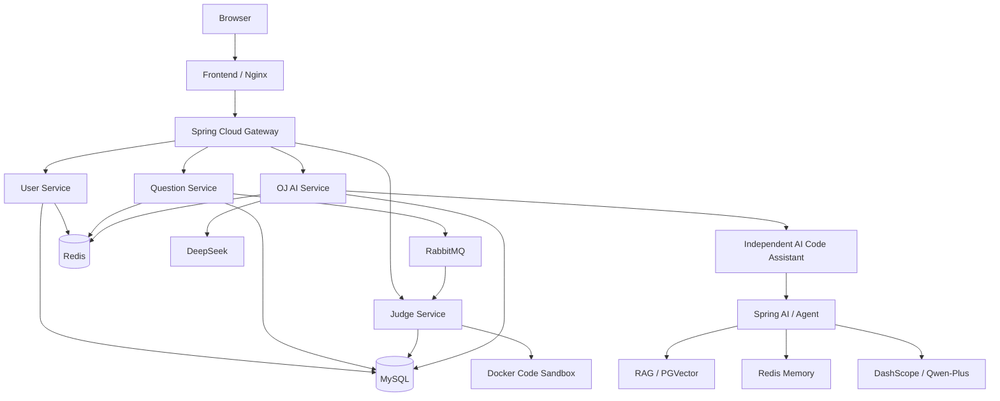

# OJ Fullstack AIGC Showcase

> AI-enhanced Online Judge & Programming Learning Platform

这是一个面向 Java 后端 / 微服务 / AI Agent 方向面试准备的工程化项目展示仓库。

本仓库主要记录项目架构、工程改造、技术方案和运行效果，不包含完整业务源码。

## 项目简介

项目围绕在线判题系统进行工程化扩展，重点解决以下问题：

- 在线判题链路可靠性
- RabbitMQ 消息一致性与重复消费
- Docker 代码沙箱隔离
- 微服务内部接口认证
- 用户认证与密码安全
- Redis 限流与防重放
- Docker Compose 一体化部署
- AI 编程辅助
- 独立 AI Code Assistant 联动

## 整体架构



## 核心工程改造

### 1. 判题可靠性

传统判题链路：

```text
保存提交
  ->
发送 MQ
  ->
Judge 消费
```

存在数据库成功但 MQ 发送失败的问题。

项目引入 Transactional Outbox：

```text
Database Transaction
  |
  |-- question_submit
  '-- judge_message_outbox
             |
             v
       Outbox Publisher
             |
             v
         RabbitMQ
```

并进一步实现：

- Outbox 原子 claim
- 失败重试
- publishing 状态恢复
- 历史消息清理
- Judge Lease
- 重复消息幂等处理
- main / retry / dead-letter MQ 拓扑

## 2. Docker Code Sandbox

用户代码不会直接在业务 JVM 中执行。

```text
Judge Service
    |
    v
Code Sandbox Service
    |
    v
Disposable Docker Container
    |
    |-- compile
    '-- execute
```

主要隔离措施：

- 禁止子容器网络
- Read-only root filesystem
- 非 root 用户
- CPU / Memory / PID 限制
- JVM Heap / Stack 限制
- drop Linux capabilities
- no-new-privileges
- stdout / stderr 大小限制
- 单测试用例超时
- 单次提交总时间预算
- 容器执行结束强制清理

当前判题语言主要为 Java。

## 3. 微服务内部认证

内部 `/inner/**` 接口采用 HMAC-SHA256 身份认证。

签名绑定：

```text
caller
HTTP method
canonical path
timestamp
nonce
```

并结合：

- Caller 白名单
- 时间窗口校验
- Redis nonce 防重放
- 常量时间签名比较
- Gateway 拦截公网 `/inner/**`
- Gateway 清理伪造内部认证 Header

## 4. 用户认证安全

主要改造：

- BCrypt 密码存储
- 历史密码兼容迁移机制
- Session ID Rotation
- Redis 登录 / 注册限流
- 管理员权限实时校验
- 用户账号数据库唯一索引
- Public User VO 不暴露敏感字段

## 5. AI Service

OJ 内置独立 AI Service。

当前模型 Provider：

```text
DeepSeek
```

AI Service 保留 Provider 抽象，并提供：

- AI 对话
- 题目分析
- 代码分析
- 编程能力评估
- AI Judge Second Review
- AI 评论辅助
- Feature Flags
- Rate Limit
- Cache
- Analysis Record
- Failure Degradation

AI 结果不会覆盖确定性 Judge Verdict。

## 6. Independent AI Code Assistant

OJ 还能通过独立版本化 API 调用另一个 AI Code Assistant：

```text
OJ AI Service
     |
     | OpenFeign
     v
AI Code Assistant
     |
     |-- Spring AI
     |-- Agent Workflow
     |-- RAG
     |-- PGVector
     |-- Redis Conversation Memory
     '-- DashScope / Qwen-Plus
```

设计原则：

- 与 OJ 独立部署
- 通过版本化 Integration API 联动
- 外部助手不可用时可以回退
- 外部 LLM 调用不进入核心确定性判题链路

## 7. 技术栈

### Backend

- Java 8
- Spring Boot 2.x
- Spring Cloud
- Spring Cloud Alibaba
- Nacos
- OpenFeign
- MyBatis Plus

### Infrastructure

- MySQL
- Redis
- RabbitMQ
- Docker
- Docker Compose
- Nginx

### Frontend

- Vue 3
- TypeScript
- Arco Design
- Monaco Editor

### AI

OJ AI Service:

- DeepSeek
- Provider abstraction
- Redis
- OpenFeign

Independent AI Code Assistant:

- Java 21
- Spring Boot
- Spring AI
- Agent
- RAG
- PGVector
- Redis Memory
- DashScope / Qwen-Plus

## 8. 服务划分

| Service | Responsibility |
| --- | --- |
| Gateway | API Gateway / Security Boundary |
| User Service | Login / Register / Profile / RBAC |
| Question Service | Question / Submit / Comment |
| Judge Service | Deterministic Judge |
| AI Service | AI Analysis / Assessment |
| Code Sandbox | Isolated Code Execution |
| Frontend | OJ Web UI |

## 9. 工程验证

项目包含多组自动化结构 / 安全检查，覆盖：

- Judge Reliability
- Docker Sandbox Hardening
- Internal HMAC Authentication
- Authentication Security
- AIGC Features
- Docker Compose Structure

稳定版本中相关检查均通过。

## 10. 项目特点

这个项目重点不是简单 CRUD，而是围绕真实工程问题进行改造：

```text
消息可靠性
+
并发与幂等
+
代码执行安全
+
微服务安全
+
缓存与限流
+
容器化
+
AI Integration
```

适合作为 Java 后端、微服务、在线判题以及 AI 应用方向的综合面试项目。

## 设计文档

| Document | Topic |
| --- | --- |
| [Judge Reliability](docs/judge-reliability.md) | Transactional Outbox、Judge Lease、幂等与故障恢复 |
| [Sandbox Security](docs/sandbox-security.md) | Docker 代码沙箱、安全边界与资源隔离 |
| [Internal Authentication](docs/internal-auth.md) | HMAC-SHA256、Canonical Path、Redis Nonce |
| [AI Integration](docs/ai-integration.md) | DeepSeek、Spring AI、Agent、RAG 与降级设计 |
| [Deployment Architecture](docs/deployment-architecture.md) | 微服务、Docker Compose 与网络边界 |

这些文档只描述工程设计、架构决策和技术实现思路，不包含完整业务源码。

## Repository Notice

This repository is a technical showcase containing architecture documentation,
engineering notes and project demonstrations.

The complete application source code is maintained separately and is not
published in this repository.
