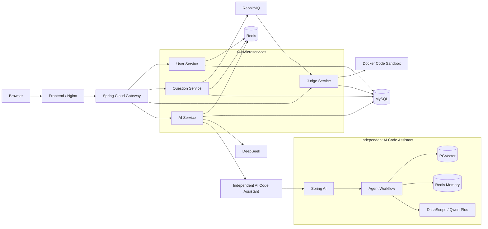
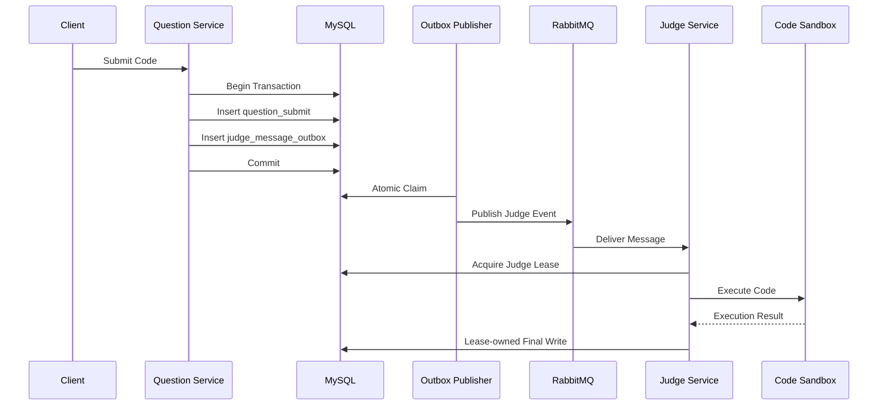
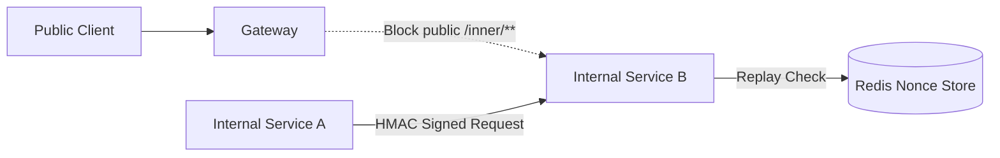
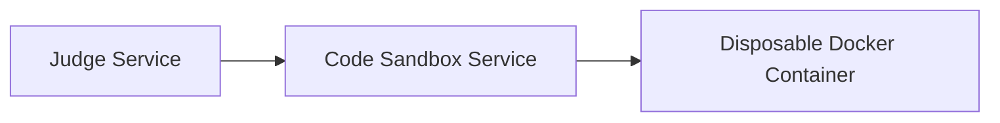
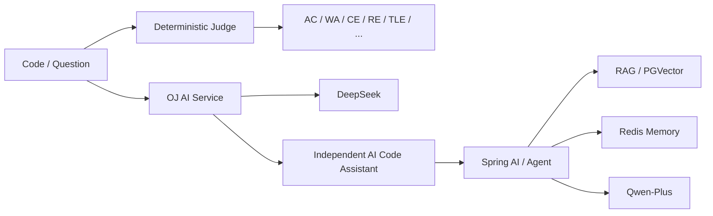

# 系统架构总览

## 1. Overall Architecture



## 2. Judge Reliability



核心机制：

```text
Transactional Outbox
        +
Atomic Claim
        +
RabbitMQ Retry / DLQ
        +
Judge Lease
        +
Idempotent Final Write
```

## 3. Internal Authentication



HMAC 签名绑定：

```text
caller
+
HTTP method
+
canonical path
+
timestamp
+
nonce
```

形成：

```text
Gateway Boundary
       +
Service HMAC Authentication
       +
Redis Replay Protection
```

## 4. Code Execution Boundary



不可信代码只在资源受限的一次性执行容器中运行。

主要限制包括：

```text
Network disabled
Read-only root filesystem
Non-root user
CPU / Memory / PID limit
JVM heap / stack limit
Timeout
Output limit
Capability drop
No-new-privileges
```

Docker Socket 本身仍属于高权限边界，因此生产环境建议将代码执行节点进一步隔离。

## 5. AI Architecture



核心设计原则：

```text
Deterministic Judge
=
Core Business Path

AI
=
Enhancement Path
```

外部模型异常不会覆盖或阻塞核心确定性判题。

## 6. Deployment Boundary

```text
Public
  |
  v
Frontend / Nginx
  |
  v
Gateway
  |
  +-----------------------------+
  |          OJ Network         |
  |                             |
  | User / Question / Judge / AI|
  |                             |
  | MySQL Redis RabbitMQ Nacos  |
  +-----------------------------+
                  |
                  | integration network
                  v
       Independent AI Assistant
```

OJ 主系统和 AI Assistant 可以独立：

```text
deploy
upgrade
restart
rollback
```

二者仅通过版本化 Integration API 联动。

## 7. Architecture Decisions

本项目重点关注以下工程边界：

| Boundary | Responsibility |
| --- | --- |
| Gateway Boundary | 公网入口与接口保护 |
| Service Boundary | HMAC 服务间认证 |
| Messaging Boundary | Outbox、MQ、重试、幂等 |
| Data Boundary | MySQL / Redis |
| Execution Boundary | Docker Code Sandbox |
| AI Boundary | LLM / Agent / RAG 故障隔离 |

设计目标不是让所有组件互相信任，而是让不同风险位于明确的边界中。
